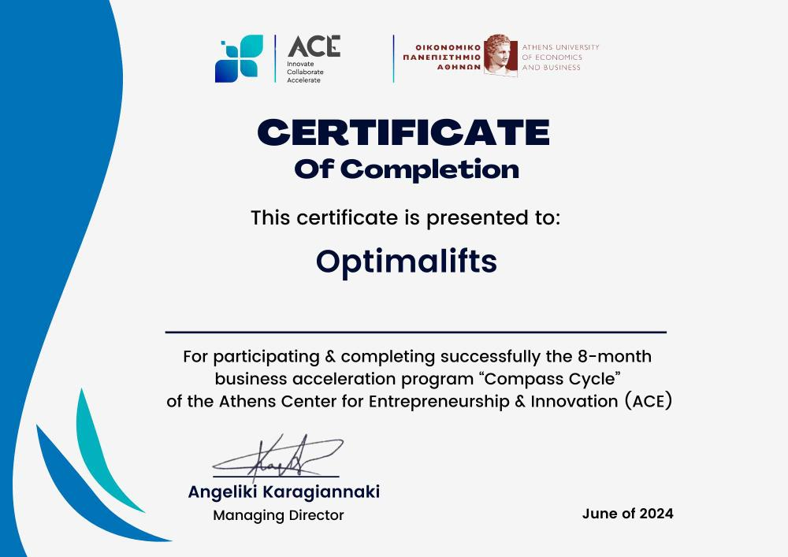

# AI Fitness Trainer

AI Fitness Trainer is a web-based application that leverages computer vision and machine learning to analyze exercise form and provide real-time feedback 
on workout performance. The project uses Python, Django, and MediaPipe for pose estimation, and integrates AI models to evaluate exercise accuracy.

## Project Background

This project was developed as part of a startup team focused on building an AI-powered personal trainer application. As a core team member, 
I contributed to the entire development process, from backend architecture to AI model integration and deployment. Our team and project were accepted 
into the ACEin (Athens Center for Entrepreneurship & Innovation) business acceleration program, run by the Athens University of Economics and Business (AUEB).

### About ACEin

The Athens Center for Entrepreneurship & Innovation (ACEin) is the entrepreneurship and innovation hub of the Athens University of Economics and Business. ACEin systematically mobilizes and guides individuals and teams in initiatives that create, strengthen, and develop entrepreneurship at both national and international levels. The program provides mentoring, resources, and a collaborative environment for startups to grow and succeed.  
Learn more: [acein.aueb.gr](https://acein.aueb.gr/)

> Το Κέντρο Επιχειρηματικότητας & Καινοτομίας του Οικονομικού Πανεπιστημίου Αθηνών  
> Συστηματική κινητοποίηση και καθοδήγηση ατόμων και ομάδων σε πρωτοβουλίες που δημιουργούν, ενισχύουν και αναπτύσσουν την επιχειρηματικότητα σε εθνικό και διεθνές επίπεδο.

As part of the ACEin “Compass Cycle” business acceleration program, our team received structured support and guidance, culminating in the successful completion of the 8-month program. We were awarded a certificate of completion, which is available upon request and may be included in this repository for reference.

## Certification
Our team was awarded a certificate of completion for the ACEin “Compass Cycle” program, recognizing our successful participation and the innovative potential 
of our AI Fitness Trainer application. 

<p align="center">

</p>

## Features

- Real-time pose detection using webcam video input
- Automated analysis of exercise form (e.g., squats, push-ups, bicep curls)
- AI-powered scoring of exercise repetitions for accuracy and form
- Video demo and tutorial media included for reference
- Modular Django backend for easy extension

## Technical Overview

The application is built on Django and uses OpenCV and MediaPipe for real-time pose detection from webcam streams. The core logic for pose estimation and angle calculation is implemented in `posemodule.py`. The system extracts joint angles from video frames and uses a trained neural network (TensorFlow/Keras) to evaluate the quality of each exercise repetition.

### Key Technologies

- **Django**: Web framework for backend and routing
- **MediaPipe**: Pose estimation and landmark detection
- **OpenCV**: Video processing and frame extraction
- **TensorFlow/Keras**: Neural network for exercise evaluation
- **SQLite**: Default database for development

### How It Works

1. **Pose Detection**: The user's webcam feed is processed frame-by-frame to detect body landmarks using MediaPipe.
2. **Angle Calculation**: Joint angles are computed from detected landmarks to represent exercise movement.
3. **AI Evaluation**: The sequence of angles is fed into a trained neural network model, which outputs a score reflecting the accuracy of the user's form.
4. **Feedback**: The score is displayed to the user in real time, helping them improve their exercise technique.

## Setup Instructions

1. **Clone the repository:**
   ```bash
   git clone https://github.com/3N-VOY/aifitness.git
   cd aifitness
   ```
2. **Create and activate a virtual environment:**
   ```bash
   python -m venv venv
    source venv/bin/activate  # On Windows: venv\Scripts\activate
   ```
3. **Install dependencies:**
     ```bash
   pip install -r requirements.txt
   ```
   If requirements.txt is missing, install Django, opencv-python, mediapipe, tensorflow.
   
5. **Apply migrations and start the server:**
   ```bash
     python manage.py migrate
      python manage.py runserver
    ```
6. **Access the app:**
    Open your browser and go to http://127.0.0.1:8000/

## Media
The media/ folder contains sample videos demonstrating supported exercises, which can be used for testing or as tutorials.

## Demo: Bicep Curl AI Analysis
[▶️ Watch Bicep Curl Demo](media/BICEP%20CURL.mp4)

## Extending the Project
Add new exercises by updating the pose estimation logic and retraining the AI model with new data.
Integrate additional feedback mechanisms (e.g., detailed form correction tips).
Deploy to a cloud platform for public access.

## Author
Developed by 3N-VOY (Alexander Xagoraris), as part of a startup team in the ACEin program at the Athens University of Economics and Business.

